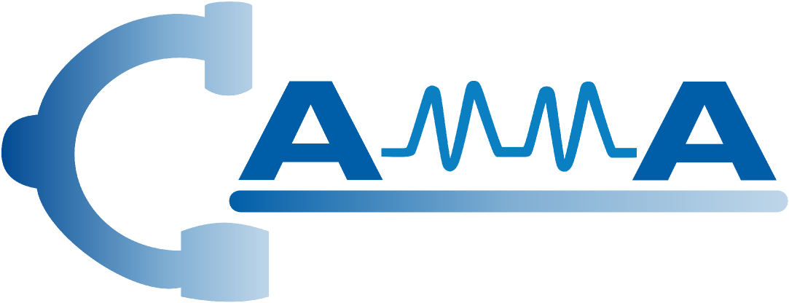

# Tripnet:
**Recognition of instrument-tissue interactions in endoscopic videos via action triplets**

<i>CI Nwoye, C Gonzalez, T Yu, P Mascagni, D Mutter, J Marescaux, and N Padoy</i>

This repository contains the implementation code, inference demo, and evaluation scripts.  

# Introduction
Recognition of surgical activity is an essential component to develop context-aware decision support for the operating room. 
In this work, we tackle the recognition of fine-grained activities, modeled as action triplets <instrument, verb, target> representing the tool activity. 
To this end, we introduce a new laparoscopic dataset, <i>CholecT40</i>, consisting of 40 videos from the public dataset Cholec80 in which all frames have been annotated using 128 triplet classes. 
Furthermore, we present an approach to recognize these triplets directly from the video data. 
It relies on a module called <i>class activation guide</i>, which uses the instrument activation maps to guide the verb and target recognition. 
To model the recognition of multiple triplets in the same frame, we also propose a trainable <i>3D interaction space (3Dis)</i>, which captures the associations between the triplet components. 
Finally, we demonstrate the significance of these contributions via several ablation studies and comparisons to baselines on CholecT40.  

 

# Model

<b>Coming soon ...</b>

