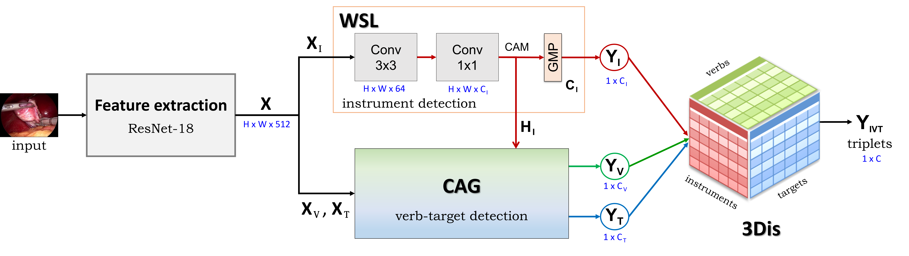

<div align="center">
<a href="http://camma.u-strasbg.fr/">

</a>
</div>
<br/>


  [](https://hamzamohdzubair.github.io/redant/)


# **Tripnet**: Recognition of instrument-tissue interactions in endoscopic videos via action triplets
<i>CI Nwoye, C Gonzalez, T Yu, P Mascagni, D Mutter, J Marescaux, and N Padoy</i>


This repository contains the implementation code, inference code, and evaluation scripts.<br />[](https://arxiv.org/abs/2007.05405) [](https://link.springer.com/chapter/10.1007/978-3-030-59716-0_35)


# Abstract
Recognition of surgical activity is an essential component to develop context-aware decision support for the operating room. In this work, we tackle the recognition of fine-grained activities, modeled as action triplets <instrument, verb, target> representing the tool activity. 

To this end, we introduce a new laparoscopic dataset, <i>CholecT40</i>, consisting of 40 videos from the public dataset Cholec80 in which all frames have been annotated using 128 triplet classes. 

Furthermore, we present an approach to recognize these triplets directly from the video data. It relies on a module called <i>class activation guide</i>, which uses the instrument activation maps to guide the verb and target recognition.  To model the recognition of multiple triplets in the same frame, we also propose a trainable <i>3D interaction space (3Dis)</i>, which captures the associations between the triplet components. Finally, we demonstrate the significance of these contributions via several ablation studies and comparisons to baselines on CholecT40.  

<br />


# News and Updates

- <b>[2023.02.20]:</b> [CholecT50](https://github.com/CAMMA-public/cholect50) dataset is now public!
- <b>[2022.05.09]:</b> TensorFlow v2 implementation code released!
- <b>[2022.05.09]:</b> TensorFlow v1 implementation code released!
- <b>[2022.05.03]:</b> PyTorch implementation code released!

<br />


# Model Overview



The Tripnet model is composed of:
* Feature Extraction layer: extract high and low level features from input image from a video
* Encoder: for triplet components encoding
    * Weakly-Supervised Localization (WSL) Layer: for localizing the instruments
    * Class Activation Guide (CAG): for detecting the verbs and targets leveraging the instrument activations.
* Decoder: for triplet assocaition due to multi-instances
    * 3D interaction space (3Dis): for learning to associate instrument-verb-target using a learning projection and for final triplet classification.


We hope this repo will help researches/engineers in the development of surgical action recognition systems. For algorithm development, we provide training data, baseline models and evaluation methods to make a level playground. For application usage, we also provide a small video demo that takes raw videos as input without any bells and whistles.

<br />


# Performance

## Results Table


Dataset ||Components AP ||||| Association AP |||
:---:|:---:|:---:|:---: |:---:|:---:|:---:|:---:|:---:|:---:|
.. | AP<sub>I</sub> | AP<sub>V</sub> | AP<sub>T</sub> ||| AP<sub>IV</sub> | AP<sub>IT</sub> | AP<sub>IVT</sub> |
CholecT40 | 89.7 | 60.7 | 38.3 ||| 35.5 | 19.9 | 19.0|
CholecT45 | 89.9 | 59.9 | 37.4 ||| 31.8 | 27.1 | 24.4|
CholecT50 | 92.1 | 54.5 | 33.2 ||| 29.7 | 26.4 | 20.0|

<br />


# Installation

## Requirements
The model depends on the following libraries:
1. sklearn
2. PIL
3. Python >= 3.5
4. ivtmetrics
5. Developer's framework:
    1. For Tensorflow version 1:
        * TF >= 1.10
    2. For Tensorflow version 2:
        * TF >= 2.1
    3. For PyTorch version:
        - Pyorch >= 1.10.1
        - TorchVision >= 0.11

<br />

## System Requirements:
The code has been test on Linux operating system. It runs on both CPU and GPU.
Equivalence of basic OS commands such as _unzip, cd, wget_, etc. will be needed to run in Windows or Mac OS.

<br />

## Quick Start
* clone the git repository: ``` git clone https://github.com/CAMMA-public/tripnet.git ```
* install all the required libraries according to chosen your framework.
* download the dataset
* download model's weights
* train
* evaluate

<br />


# Dataset Zoo

* CholecT40
* [CholecT45](https://github.com/CAMMA-public/cholect45) 
* [CholecT50](https://github.com/CAMMA-public/cholect50) 
* [Dataset splits](https://arxiv.org/abs/2204.05235)

<br />

## Data Preparation

* All frames are resized to 256 x 448 during training and evaluation.
* Image data are mean normalized.
* The dataset variants are tagged in this code as follows: 
   - cholect50 = CholecT50 with split used in the original paper.
   - cholect50-challenge = CholecT50 with split used in the CholecTriplet challenge.
   - cholect45-crossval = CholecT45 with official cross-val split **(currently public released)**.
   - cholect50-crossval = CholecT50 with official cross-val split.

<br />


## Evaluation Metrics

The *ivtmetrics* computes AP for triplet recognition. It also support the evaluation of the recognition of the triplet components.
```
pip install ivtmetrics
```
or
```
conda install -c nwoye ivtmetrics
```
Usage guide is found on [pypi.org](https://pypi.org/project/ivtmetrics/).

<br />


# Running the Model

The code can be run in a trianing mode (`-t`) or testing mode (`-e`)  or both (`-t -e`) if you want to evaluate at the end of training :

<br />

## Training on CholecT45/CholecT50 Dataset

Simple training on CholecT50 dataset:
```
python run.py -t  --data_dir="/path/to/dataset" --dataset_variant=cholect50 --version=1
```

You can include more details such as epoch, batch size, cross-validation and evaluation fold, weight initialization, learning rates for all subtasks, etc.:

```
python3 run.py -t -e  --data_dir="/path/to/dataset" --dataset_variant=cholect45-crossval --kfold=1 --epochs=180 --batch=64 --version=2 -l 1e-2 1e-3 1e-4 --pretrain_dir='path/to/imagenet/weights'
```

All the flags can been seen in the `run.py` file.
The experimental setup of the published model is contained in the paper.

<br />

## Testing

```
python3 run.py -e --dataset_variant=cholect45-crossval --kfold 3 --batch 32 --version=1 --test_ckpt="/path/to/model-k3/weights" --data_dir="/path/to/dataset"
```

<br />

## Training on Custom Dataset

Adding custom datasets is quite simple, what you need to do are:
- organize your annotation files in the same format as in [CholecT45](https://github.com/CAMMA-public/cholect45) dataset. 
- final model layers can be modified to suit your task by changing the class-size (num_tool_classes, num_verb_classes, num_target_classes, num_triplet_classes) in the argparse.

<br />


# Model Zoo

* **N.B.** Download links to models' weights will not be provided until after the CholecTriplet2022 challenge.


## PyTorch
| Network   | Base      | Resolution | Dataset   | Data split  |  Link             |
------------|-----------|------------|-----------|-------------|-------------------|
| Tripnet   | ResNet-18 | Low        | CholecT50 | RDV         |   [Download](https://s3.unistra.fr/camma_public/github/tripnet/tripnet_cholect50_batchnorm_lowres.pth) |
| Tripnet   | ResNet-18 | High       | CholecT50 | RDV         |   [Download]|
| Tripnet   | ResNet-18 | Low        | CholecT50 | Challenge   |   [Download](https://s3.unistra.fr/camma_public/github/tripnet/tripnet_cholect50_challenge_k0_batchnorm_lowres.pth.pth) |
| Tripnet| ResNet-18 | Low        | CholecT50 | crossval k1 |   [Download](https://s3.unistra.fr/camma_public/github/tripnet/tripnet_cholect50_crossval_k1_layernorm_lowres.pth) |
| Tripnet| ResNet-18 | Low        | CholecT50 | crossval k2 |   [Download](https://s3.unistra.fr/camma_public/github/tripnet/tripnet_cholect50_crossval_k2_batchnorm_lowres.pth) |
| Tripnet| ResNet-18 | Low        | CholecT50 | crossval k3 |   [Download](https://s3.unistra.fr/camma_public/github/tripnet/tripnet_cholect50_crossval_k3_batchnorm_lowres.pth) |
| Tripnet| ResNet-18 | Low        | CholecT50 | crossval k4 |   [Download](https://s3.unistra.fr/camma_public/github/tripnet/tripnet_cholect50_crossval_k4_layernorm_lowres.pth) |
| Tripnet| ResNet-18 | Low        | CholecT50 | crossval k5 |   [Download](https://s3.unistra.fr/camma_public/github/tripnet/tripnet_cholect50_crossval_k5_layernorm_lowres.pth) |
| Tripnet| ResNet-18 | Low        | CholecT45 | crossval k1 |   [Download](https://s3.unistra.fr/camma_public/github/tripnet/tripnet_cholect45_crossval_k1_layernorm_lowres.pth) |
| Tripnet| ResNet-18 | Low        | CholecT45 | crossval k2 |   [Download](https://s3.unistra.fr/camma_public/github/tripnet/tripnet_cholect45_crossval_k2_batchnorm_lowres.pth) |
| Tripnet| ResNet-18 | Low        | CholecT45 | crossval k3 |   [Download](https://s3.unistra.fr/camma_public/github/tripnet/tripnet_cholect45_crossval_k3_batchnorm_lowres.pth) |
| Tripnet| ResNet-18 | Low        | CholecT45 | crossval k4 |   [Download](https://s3.unistra.fr/camma_public/github/tripnet/tripnet_cholect45_crossval_k4_layernorm_lowres.pth) |
| Tripnet| ResNet-18 | Low        | CholecT45 | crossval k5 |   [Download](https://s3.unistra.fr/camma_public/github/tripnet/tripnet_cholect45_crossval_k5_layernorm_lowres.pth) |

<br />

## TensorFlow v1

| Network   | Base      | Resolution | Dataset   | Data split    | Link             |
------------|-----------|------------|-----------|---------------|------------------|
| Tripnet   | ResNet-18 | High       | CholecT50 | RDV           |  [Download] |
| Tripnet   | ResNet-18 | High       | CholecT50 | Challenge     |  [Download] |

<br />


<br />

## TensorFlow v2

| Network   | Base      | Resolution | Dataset   | Data split    | Link             |
------------|-----------|------------|-----------|---------------|------------------|
| Tripnet   | ResNet-18 | High       | CholecT50 | RDV           |   [Download] |
| Tripnet   | ResNet-18 | Low        | CholecT50 | RDV           |   [Download] |
| Tripnet   | ResNet-18 | High       | CholecT50 | Challenge     |   [Download] |

<br />

## Baseline and Ablation Models

TensorFlow v1
| Model | AP<sub>i</sub> | AP<sub>iv</sub> | AP<sub>it</sub> |AP<sub>IVT</sub> | Link |
------------|------------|------|-----|-----|-----|
|Naive CNN  | 27.5 | 7.5 | 6.8 | 5.9 | [Download] |
|MTL baseline | 74.6 |14.0 | 7.2 | 6.4 | [Download] |
|Tripnet w/o CAG   | 89.5 | 20.6 | 12.1 | 12.1 | [Download] |
|Tripnet w/c untrained 3Dis | 89.7 | 16.7 | 7.6 | 6.3 | [Download] |


Models are being re-trained and weights are released periodically.

<br /><br />


# License


This code, models, and datasets are available for **non-commercial scientific research purposes** provided by [CC BY-NC-SA 4.0 LICENSE](https://creativecommons.org/licenses/by-nc-sa/4.0/) attached as [LICENSE file](LICENSE). 
By downloading and using this code you agree to the terms in the [LICENSE](LICENSE). Third-party codes are subject to their respective licenses.


<br />


# Related Resources
<b>
   
-  CholecT45 / CholecT50 Datasets
   [](http://camma.u-strasbg.fr/datasets)    [](https://github.com/CAMMA-public/cholect45)   
-  Offical Dataset Splits 
   [](https://arxiv.org/abs/2204.05235)
- Rendezvous 
    [](https://arxiv.org/abs/2109.03223)     [](https://doi.org/10.1016/j.media.2022.102433)    [](https://github.com/CAMMA-public/rendezvous) 
-  Attention Tripnet
   [](https://arxiv.org/abs/2109.03223)    [](https://github.com/CAMMA-public/attention-tripnet) 
-  CholecTriplet2021 Challenge
   [](https://cholectriplet2021.grand-challenge.org)    [](https://arxiv.org/abs/2204.04746)    [](https://github.com/CAMMA-public/cholectriplet2022) 
-  CholecTriplet2022 Challenge
   [](https://cholectriplet2022.grand-challenge.org)    [](https://github.com/CAMMA-public/cholectriplet2022)
 
</b>

<br />


# Citation
If you find this repo useful in your project or research, please consider citing the relevant publications:

- For the Tripnet and Baseline Models or any code from this repo:
```
@inproceedings{nwoye2020recognition,
   title={Recognition of instrument-tissue interactions in endoscopic videos via action triplets},
   author={Nwoye, Chinedu Innocent and Gonzalez, Cristians and Yu, Tong and Mascagni, Pietro and Mutter, Didier and Marescaux, Jacques and Padoy, Nicolas},
   booktitle={International Conference on Medical Image Computing and Computer-Assisted Intervention (MICCAI)},
   pages={364--374},
   year={2020},
   organization={Springer}
}
```

- For the CholecT45/CholecT50 Dataset:
```
@article{nwoye2021rendezvous,
  title={Rendezvous: Attention Mechanisms for the Recognition of Surgical Action Triplets in Endoscopic Videos},
  author={Nwoye, Chinedu Innocent and Yu, Tong and Gonzalez, Cristians and Seeliger, Barbara and Mascagni, Pietro and Mutter, Didier and Marescaux, Jacques and Padoy, Nicolas},
  journal={Medical Image Analysis},
  volume={78},
  pages={102433},
  year={2022}
}
```


- For the CholecT45/CholecT50 Official Dataset Splits:
```
@article{nwoye2022data,
  title={Data Splits and Metrics for Benchmarking Methods on Surgical Action Triplet Datasets},
  author={Nwoye, Chinedu Innocent and Padoy, Nicolas},
  journal={arXiv preprint arXiv:2204.05235},
  year={2022}
}
```


- For the Rendezvous or Attention Tripnet Baseline Models or any snippet of code from this repo:
```
@article{nwoye2021rendezvous,
  title={Rendezvous: Attention Mechanisms for the Recognition of Surgical Action Triplets in Endoscopic Videos},
  author={Nwoye, Chinedu Innocent and Yu, Tong and Gonzalez, Cristians and Seeliger, Barbara and Mascagni, Pietro and Mutter, Didier and Marescaux, Jacques and Padoy, Nicolas},
  journal={Medical Image Analysis},
  volume={78},
  pages={102433},
  year={2022}
}
```


- For the models presented @ CholecTriplet2021 Challenge:
```
@article{nwoye2022cholectriplet2021,
  title={CholecTriplet2021: a benchmark challenge for surgical action triplet recognition},
  author={Nwoye, Chinedu Innocent and Alapatt, Deepak and Vardazaryan, Armine ... Gonzalez, Cristians and Padoy, Nicolas},
  journal={arXiv preprint arXiv:2204.04746},
  year={2022}
}
```

#
This repo is maintained by [CAMMA](http://camma.u-strasbg.fr). Comments and suggestions on models are welcomed. Check this page for updates.


